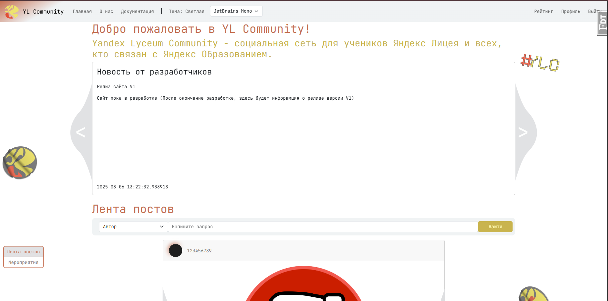
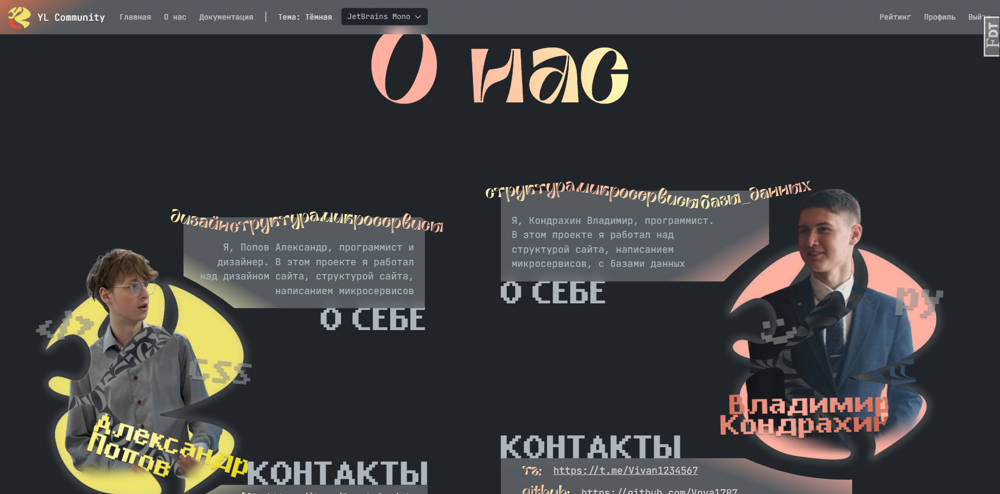
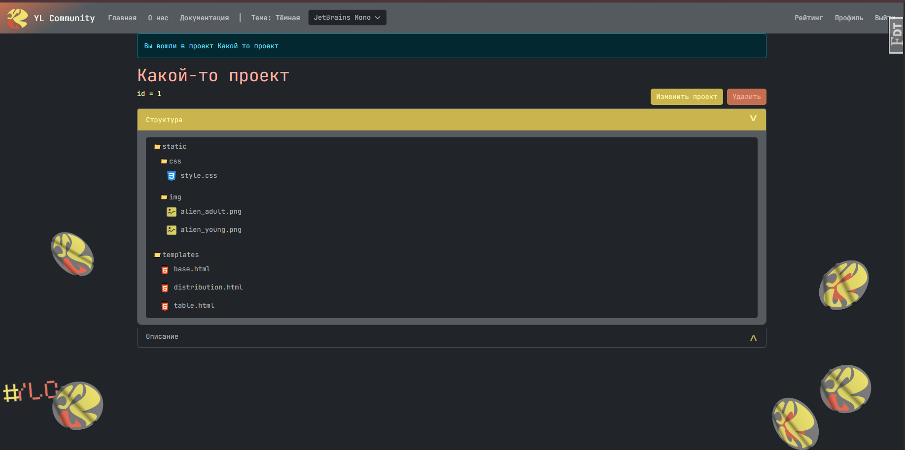
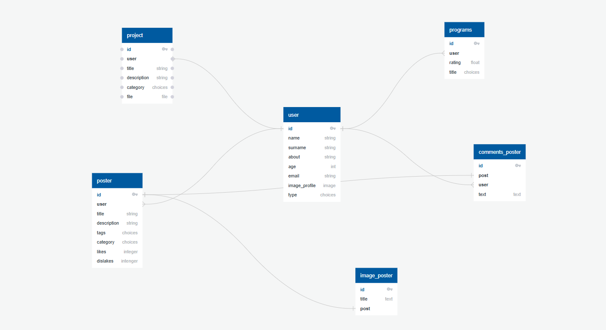

[](https://github.com/Vova1707/YL_Community/actions/workflows/tests.yml)

<center>**YL Community**</center>
--
## Описание
---
YL Community - Это социальная сеть для учеников Яндекс Лицея и для всех, кто как то связан с Яндекс Образованием. 
В ней ученики и учителя смогут делиться проектами, выкладывать свои личные достижения, связанные с образованием, и 
не только, вести свой личный блок, участвовать или проводить различные квесты, проекты или конкурсы.

## Актуальность
---
На данный момент не существовало общей платформы, для обледенения лицеистов, преподавателей, организаторы и других 
участников и лиц, связанных с "Яндекс Образованием", были лишь тг каналы и группы в различных соцсетях, В этих группах 
можно лишь общаться и обмениваться определёнными файлами. С помощью нашего проекта теперь они смогут хранить делиться 
проектами, участвовать в конкурсах, обсуждать какие-то проблемы, тем самым объединяться в команды.

## Фичи
---
(✔ - сделана / ✖ - в разработке)

✔ - посты с комментариями

✔ - полноценный редактор файлов с кодом

✖ - форум

✖ - редактор таблиц

✖ - все функции работы с архивом

## Ссылки и контакты
---
[репозиторий](https://github.com/Vova1707/Game-jam)

Владимира Кондрахин:
[тг](https://t.me/Vivan1234567),
[github](https://github.com/Vova1707),
[почта](https://mail.yandex.ru/compose?to=kondrahinvov@yandex.ru)

Попов Александр:
[тг](https://t.me/ProstoSaniok),
[github](https://github.com/ImennoYASaniok),
[почта](https://mail.yandex.ru/compose?to=Banlichelendsh@yandex.ru)

## Скриншоты
---




## Перед работой с проектом
---

### Операционная система:
Лучше использовать конечно Linux. Но можно и Windows.

### Установка
1. **Интерпретатор Python:** ```sudo apt install python3```

2. **Git:** ```sudo apt install git```

3. **Клонируйте репозиторий:** ccылка для клонирования - ```git clone https://github.com/Vova1707/YL_Community.git```

4. **Настройка проекта:**
Потом здесь про всё всё

5. **Создайте виртуальную среду:** ```python3 -m venv .venv```
6. **Активируйте виртуальную среду:** ```source .venv/bin/activate```

### Структура базы данных
   